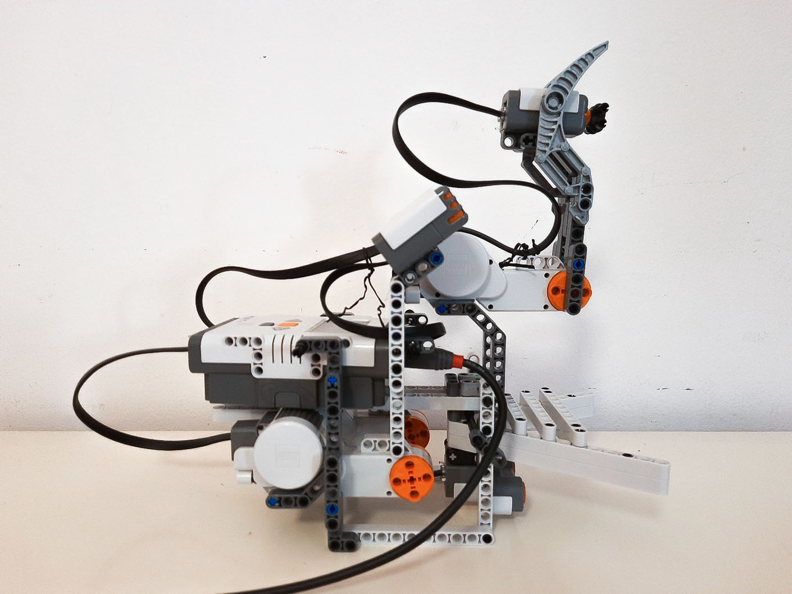
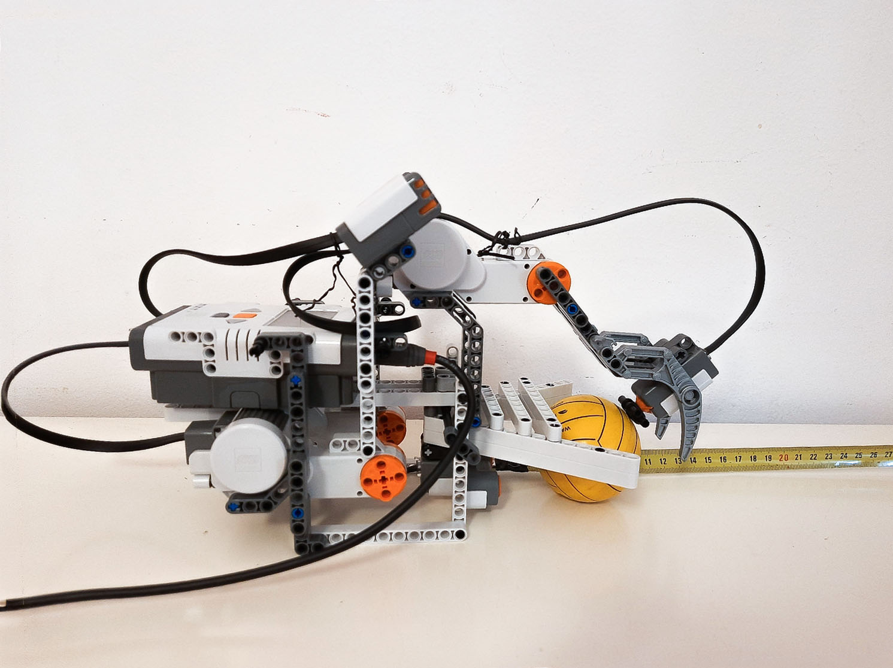

---
jupytext:
  text_representation:
    extension: .md
    format_name: myst
    format_version: 0.13
    jupytext_version: 1.19.5
kernelspec:
  display_name: Python 3 (ipykernel)
  language: python
  name: python3
---

# Grasping robot: a live object-grasping qBrain

```{admonition} Research provenance
This is a lightweight pedagogical reimplementation of the object-grasping
architecture in [*Quantum-like Modeling of Cognitive Architectures for
Robotics*](https://doi.org/10.5281/zenodo.22068511). The architecture diagram
and robot photograph are archival assets of this master's thesis work.
The two-dimensional world is a  new visualization generated by
`examples/grasping_robot.py` using the current Redis-connected qUnit implementation.
```

In [*Quantum-like Modeling of Cognitive Architectures for
Robotics*](https://doi.org/10.5281/zenodo.22068511) we use a carnivorous-plant
metaphor: a stationary robot waits for an
object, closes its gripper when the object is reachable, and uses an internal
touch sensor to detect contact. Navigation is deliberately absent so the
complete chain from physical signal to action remains visible.

| Open gripper | Closed gripper |
| :---: | :---: |
|  |  |

## Architecture

```{image} ./07_imgs/grasping_architecture.png
:alt: Diagram showing two sensor interfaces, two perceptual qUnits, and a gripper actuator
:width: 680px
:align: center
```

The network uses the package's three explicit runtime roles:

1. An ultrasonic sensor measures a continuous distance in centimetres. Its
   interface normalizes that measurement to the interval $[0,1]$: `1` means
   closest and `0` means farthest or out of range.
2. A touch interface produces `1` while the gripper is empty and `0` when its
   internal switch is pressed.
3. Perceptual qUnit $p_1$ integrates 10 samples at $T_s=0.1$ s, so its
   effective window is 1 second.
4. Perceptual qUnit $p_2$ integrates 50 samples at the same rate, producing a
   slower 5-second assessment.
5. The actuator averages the two bursts and closes only when the normalized
   sum is strictly greater than `0.5`.

The **touch sensor is inside the gripper**. It reports contact only after the
jaws have closed around prey. In the carnivorous-plant analogy, that contact is
also the plant's feedback that it is still consuming what it caught. Once the
prey has been absorbed, the contact disappears: “I have absorbed what I could;
now I can open for the next one.” Thus touch is not an external presence
detector. While the robot waits with open jaws it merely reports that the
gripper is empty, so proximity is still needed to initiate a grasp.

The two sensors answer different questions:

- proximity asks, “is there an object close enough to attempt a grasp?”;
- touch asks, “is the gripper still empty, or did that attempt make contact?”

For binary qUnit bursts, the actuator's strict `> 0.5` threshold acts like an
AND gate:

| Proximity burst | Empty-gripper burst | Mean | Command |
| ---: | ---: | ---: | --- |
| 0 | 1 | 0.5 | remain open: nothing is reachable |
| 1 | 1 | 1.0 | close: an object is near and the gripper is empty |
| 1 | 0 | 0.5 | open after contact has persisted through the slow window |

The unequal windows are the point of the architecture. Proximity supplies a
relatively fast assessment of the approaching object, whereas touch supplies
slower feedback about the result of the grasp. Each decision represents a
whole sensor history, rather than forwarding the latest raw sample directly to
the motor.

This intentionally clean demonstration does **not** claim that a qBrain is the
cheapest controller for a deterministic gripper. A conventional distance
threshold plus a small state machine would be simpler. The example isolates
the thesis's research question: how perceptual evidence and feedback can be
represented as independently timed, stochastic quantum-like decisions and
then composed into an actuator interface. Noise, ambiguous objects, or several
competing behaviors would make temporal evidence integration more consequential;
they are omitted here so the causal chain remains readable.


## Sensor interfaces

The simulated ultrasonic sensor first produces a continuous distance in
centimetres. `proximity_interface` then converts it to the normalized scalar
that a `SensorialUnit` accepts. The mapping follows the architecture diagram:
distances at or below 5 cm map to `1`, distances at or above 20 cm map to `0`,
and values between those limits are linearly interpolated. These values come
from the robot's geometry: 5 cm is the distance from the ultrasonic sensor to
the robot's front surface, while 15 cm is the outer entrance to the grippable
area. The remaining 15--20 cm interval provides advance warning before an
object reaches the jaws. Thus *closer means a higher input*. This inversion of
physical distance is intentional: with query `[1.0]`, $p_1$ asks whether its
temporal window resembles the closest-object target. No extra negation or
complementary query is required.

The touch interface is already binary: `False` (empty/not pressed) maps to `1`,
and `True` (pressed) maps to `0`.

```{code-cell} ipython3
import matplotlib.pyplot as plt
import numpy as np
from qrobot_simulator.grasping_robot import proximity_interface, touch_interface

distances = np.linspace(0, 45, 200)
proximity_values = [proximity_interface(distance) for distance in distances]

fig, (distance_axis, touch_axis) = plt.subplots(1, 2, figsize=(10, 3.2))
distance_axis.plot(distances, proximity_values)
distance_axis.set(
    xlabel="Object distance (cm)",
    ylabel="Normalized proximity",
    ylim=(-0.05, 1.05),
    title="Distance interface",
)
touch_axis.bar(["empty", "pressed"], [touch_interface(False), touch_interface(True)])
touch_axis.set(ylabel="Normalized signal", ylim=(0, 1.05), title="Touch interface")
fig.tight_layout()
plt.show()
```

## qBrain

The `GraspingRobot` internal components are the following:

```{code-cell} ipython3
from qrobot_qunits import RedisConfig
from qrobot_simulator.grasping_robot import build_grasping_qbrain

sensors, qunits, actuator = build_grasping_qbrain(redis_config=RedisConfig())
```

```{code-cell} ipython3
sensors
```

The two `SensorialUnit` workers publish the latest normalized interface values
to Redis. `grasp_distance` receives the continuous proximity value described
above; `grasp_touch` receives `1` while the internal switch is not pressed and
`0` when contact presses it. They transport readings but do not perform the
temporal decision themselves.

```{code-cell} ipython3
qunits
```

The perceptual qUnits independently sample those Redis values. `grasp_proximity`
compares a 1-second distance history with query `[1.0]` (the closest-object
target). `grasp_empty` compares a 5-second touch history with `[1.0]` (the
empty-gripper target). Each publishes a stochastic binary `ZeroBurst`; a `1`
therefore means that the window matched that unit's target closely enough for
the sampled measurement to be zero.

```{code-cell} ipython3
actuator
```

- the `ActuatorUnit` averages its incoming bursts, then sends the activation signal
  only when the result is strictly greater than its threshold.

## Live demo

The `BallPrey` robot starts gently at a varied middle-to-far position and then wanders by
receiving random changes in speed and direction. Those changes do not inspect
its position: there is no rule steering it toward or away from the mouth. Only
collisions with the arena edges or closed jaws depend on location. This makes
hesitation, reversals, near misses, and deceptive approaches possible
throughout the sensor range instead of producing a scripted beeline followed
by back-and-forth motion. Pass `--seed` to replay the same random motion.

```{image} ./07_imgs/grasping_live_world.png
:alt: Live 2-D grasping world with robot, ball, sensor regions, and qBrain signals
:width: 680px
:align: center
```

The orange band represents the complete 20 cm distance-sensor range, measured
from the sensor origin beside the robot body to the dotted orange boundary.
The green 5--15 cm section is the physical grippable area; 5 cm ends at the
robot surface, 15 cm is the jaws' outer entrance, and 15--20 cm is the warning
region. The dashed line measures to the ball centre, matching the value shown
in cm.
The two small grey pads at the inner tips of the jaws are the physical touch sensor.
When closed jaws contact the ball, the touch signal changes from empty (`1`) to pressed (`0`).

Closed jaws are also a physical barrier. A ball caught while the jaws close is
held while the plant “digests” it, and an outside ball cannot pass through
closed jaws. After 2.5 simulated seconds the caught ball vanishes and a new
ball appears at a random far position, ready for another encounter.
The live score counts a **correct** grip on closure around a ball, a **missed**
grip when a visit to the jaw area ends uncaught, and an **empty** grip whenever
the jaws close without a ball inside.

The faster proximity unit responds first.
The gripper closes only once both bursts are active.
The contact with the ball then changes the touch interface immediately,
but the slow qUnit needs a complete temporal window before its burst changes.
This delay is the architectural effect the simulation exposes visually:
actuation is based on temporally integrated qUnit decisions rather than raw sensor values.

The result is stochastic because each qUnit produces a one-shot measurement at the end of its window.
Exact transition times can vary between runs, while the wiring and temporal scales remain fixed.

## Run the example

With Redis listening on `localhost:6379`:

```bash
python examples/grasping_robot.py
```

The encounter repeats until its window is closed or `Ctrl-C` is pressed.
`--speed` selects a simulation-time/wall-clock-time ratio in `(0, 10]` while
preserving the ratio between the one- and five-second qUnit windows. Both
qUnits are warmed up before the scenario clock starts, so process startup is
not mistaken for sensor history. `--seed` makes the random path reproducible.
A reproducible headless frame can also be saved:

```bash
python examples/grasping_robot.py --duration 10 --seed 7 --no-show \
  --save-world grasping_live_world.png
```

The thin runner creates only its own Redis keys and removes them when its
workers stop. It requires neither ROS nor LEGO hardware; the packaged
`GraspingRobot` and `BallPrey` define the participants, `GraspingWorld` owns
their physical interaction and sensor readings, and `GraspingWorldLiveView`
renders that state.

## Reference

- D. Lanza, [*Quantum-like Modeling of Cognitive Architectures for
  Robotics*](https://doi.org/10.5281/zenodo.22068511), Zenodo, 2020.
