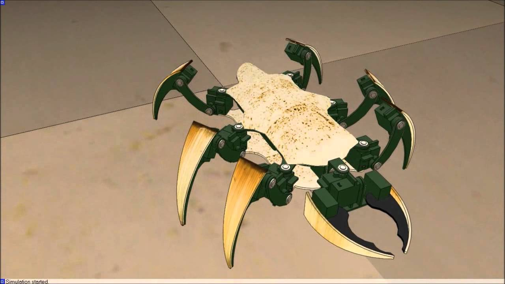
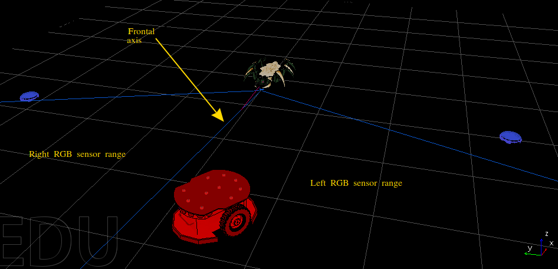

---
jupytext:
  text_representation:
    extension: .md
    format_name: myst
    format_version: 0.13
    jupytext_version: 1.19.5
kernelspec:
  display_name: Python 3 (ipykernel)
  language: python
  name: python3
---

# Bug world: a live predator/prey qBrain

```{warning}
`qrobot_simulator` is experimental. This tutorial uses scenario-specific
predator/prey, sensing, movement, and rendering interfaces that may change
between minor releases.
```

```{admonition} Research provenance
This tutorial implements the bug-like architecture in
[*Quantum-like Modeling of Cognitive Architectures for
Robotics*](https://doi.org/10.5281/zenodo.22068511). The robot, environment, and
architecture images are archival assets of this master's thesis work. The live
two-dimensional world is generated by `examples/bug_world.py` using the current
Redis-connected qUnit implementation.
```

The bug-like robot inhabits a world with blue prey and a red predator. Two RGB
eyes and a frontal proximity sensor provide its evidence. Its qBrain combines
that evidence into five behaviors: bite, move forward, move backward, rotate
left, and rotate right.

| Bug-like robot in the CoppeliaSim simulation  | Predator/prey world in the CoppeliaSim simulation |
| :---: | :---: |
|  |  |

The master's thesis evaluated the architecture in CoppeliaSim with ROS. This
tutorial evaluates the same perceptual and cognitive signal graph in the
packaged `qrobot_simulator` world.

## Architecture

```{image} ./08_imgs/bug_architecture.png
:alt: Architecture with seven sensor interfaces, five perceptual qUnits, two cognitive qUnits, and five actuators
:width: 720px
:align: center
```

The network has four stages:

1. seven sensor interfaces publish proximity and left/right RGB readings;
2. five perceptual qUnits recognize proximity, red, or blue evidence;
3. two cognitive qUnits combine that evidence into prey and threat decisions;
4. five actuators turn those decisions into biting, translation, and rotation.

The two layers use different temporal windows. Perceptual units react to short
sensor histories, while cognitive units integrate the resulting perceptual
bursts over a longer history. Consequently, an actuator receives decisions
about completed windows rather than forwarding the latest raw eye value.

| Behavior | Evidence used |
| --- | --- |
| bite | frontal proximity and prey cognition |
| move forward | prey cognition and eye-feature bursts |
| move backward | threat cognition |
| rotate left | left-blue and right-red perception |
| rotate right | left-red and right-blue perception |

Each `ActuatorUnit` averages its incoming bursts and publishes an activation
only when that normalized value is strictly greater than its threshold.
The thresholds reflect the discrete burst levels: forward combines prey
cognition with the eye-feature bursts to maintain a search drive when no target
is visible, backward requires a stronger threat decision, and the two-input
rotation actuators require strong lateral evidence. Backward also
has a larger physical gain than forward, so simultaneous opposing qBrain
activations still produce retreat rather than cancelling each other.

## qBrain

The qBrain can be constructed independently of the physical world for inspection:

```{code-cell} ipython3
from pprint import pprint
from qrobot_qunits import RedisConfig
from qrobot_simulator.bug_world.robots.bug_robot import build_bug_qbrain

sensors, qunits, actuators = build_bug_qbrain(RedisConfig())
```

Seven **sensorial** units transport normalized world readings:

```{code-cell} ipython3
sensors
```

Five **perceptual** units and two **cognitive** units process those readings:

```{code-cell} ipython3
qunits
```

The 5 **actuators** expose the live input wiring and thresholds:

```{code-cell} ipython3
actuators
```

```{code-cell} ipython3
actuator_configuration = {
    name: {
        "incoming_units": actuator.in_qunits,
        "threshold": actuator.threshold,
    }
    for name, actuator in actuators.items()
}
pprint(actuator_configuration, sort_dicts=False)
```

## Simulated world

`BugWorld.demo()` constructs the same arena and animals used by the public
example. A plain actuator-driven bug body is used here:

```{code-cell} ipython3
from qrobot_simulator.bug_world import BugWorld

world = BugWorld.demo()
```

```{code-cell} ipython3
pprint(world.board, sort_dicts=False)
```

```{code-cell} ipython3
pprint(world.bug, sort_dicts=False)
```

```{code-cell} ipython3
pprint(world.prey, sort_dicts=False)
```

```{code-cell} ipython3
pprint(world.predator, sort_dicts=False)
```

The world computes the exact seven normalized values consumed by the packaged
sensor units:

```{code-cell} ipython3
pprint(world.readings, sort_dicts=False)
```

Each RGB eye points $30^\circ$ away from the bug's heading. Its response
decreases with angular error and distance. Blue prey stimulate the blue eye
channels, the red predator stimulates the red channels, and the frontal
proximity sensor becomes active within its configured $1.25$-unit range and
$\pm25^\circ$ field of view. Bite contact is calculated separately from the
two body radii and the configured bite reach. The simulation deliberately
contains no green animal, so both green channels stay at zero.

One prey follows a repeatable curved path and the other wanders randomly; both
flee nearby hunters. The predator pursues the qBrain bug. `BugWorld.step()`
advances those animals, applies the bug's actuator values, detects bites,
respawns captured prey, and refreshes the sensor readings.

## Live demo

```{image} ./08_imgs/bug_live_world.png
:alt: Live chessboard with qBrain bug, two blue prey, red predator, and sensor rays
:width: 720px
:align: center
```

The live view shows the chessboard, four robots, frontal proximity region, both
RGB eye fields, current behavior, proximity region, and scores. `BITTEN PREY`
counts successful bug bites. `PREDATOR BITES` counts predator contacts, with a
cooldown so continuous contact is not scored once per frame.

World geometry produces sensor values;
qUnits integrate those values and publish bursts; actuators select behavior;
and that behavior changes the next world state.
The renderer only displays this state and never infers behavior.

The red and blue perceptual units use `ZeroBurst` to query their target colors,
while the cognitive units use `OneBurst`. Every readout is a one-shot
measurement, so paths and firing patterns can vary even from similar geometry.

## Run the example

Start Redis on `localhost:6379`, then run:

```bash
python examples/bug_world.py
```

The simulation runs until its window closes or `Ctrl-C` is pressed. The world
refresh rate can be changed independently of the qUnit worker periods:

```bash
python examples/bug_world.py --fps 5
```

For a bounded or headless run:

```bash
python examples/bug_world.py --duration 20
python examples/bug_world.py --duration 10 --no-show \
  --save-world bug_live_world.png
```

On shutdown it stops its workers and removes only the Redis keys owned by its `BugRobot`.

## Reference

- D. Lanza, [*Quantum-like Modeling of Cognitive Architectures for
  Robotics*](https://doi.org/10.5281/zenodo.22068511), Zenodo, 2020.
